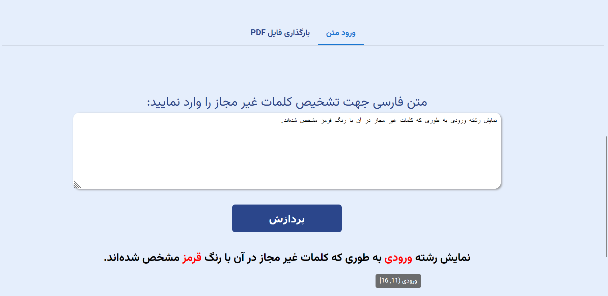

<div dir="rtl">

# تشخیص‌دهنده کلمات غیر قانونی در فارسی


ما در این پروژه قصد داریم که با کمک کلمات غیر قانونی که وارد میکنید؛ بتوانیم کلمات غیرقابل قبول را استخراج نماییم.
یکی از چالش های NLP این است که بتوانیم کلماتی که مطلب نیستند را شناسایی کنیم، برای مثال میتوانیم کلماتی که محدودیتی برای
استفاده دارند را پیدا کنیم، سپس در متون
به دنبال شان بگردیم و محدودیت لازم را اجرا کنیم

این پروژه یک سیستم تشخیص کلمات غیرمجاز در یک متن فارسی است. این سیستم می‌تواند به عنوان یک فیلتر برای حفظ شفافیت در متون
اداری و قانونی، ارزشمند باشد.


## نحوه‌ی استفاده

این پروژه برای دمو، شامل سرور بک‌اند (با REST-API) و یک برنامه‌ی فرانت‌اند (با React) می‌باشد.
برای سهولت استفاده، از داکر استفاده شده است.
برای اجرای برنامه، ابتدا باید داکر را نصب کنید.
سپس از داکر کامپوز را نصب کنید.
برای اجرا، از دستور زیر استفاده کنید:

```bash
docker-compose build
docker-compose up -d
```

سپس برای دسترسی به برنامه، این لینک زیر استفاده کنید:

http://localhost:3000

مستندات api ها نیز در لینک زیر قابل دسترسی هستند:

http://localhost:8080/docs

خروجی به صورت یک دیکشنری است که کلید آن کلمات غیرمجاز و مقدار آن یک لیست از کلمات غیر مجاز پیدا شده در متن است. هر کلمه غیر مجاز نیز شامل یک رشته و محدوده آن در متن است.

## قابلیت‌ها
- نمایش رشته ورودی به طوری که کلمات غیر مجاز در آن با رنگ قرمز مشخص شده‌اند.
- با حرکت موس بر روی هر قسمت تشخیص داده شده کلمه غیرمجازی که در آن پیدا شده به همراه بازه‌ای از متن اصلی که کلمه در آن پیدا شده به کاربر نمایش داده می‌شود.
- رابط کاربری آسان برای وارد کردن و حذف تعاملی کلمات غیر مجاز
- قابلیت آپلود فایل پی‌دی‌اف و خواندن محتوای متنی آن و اجرای پایپلاین روی آن
- نمایش تمامی کلمات غیر مجاز پیدا شده در فایل پی‌دی‌اف و نمایش بازه‌هایی از متن که در آن پیدا شده‌اند.
- قابلیت اجرای پیاپی پایپلاین برروی متن‌های مختلف و کلمات غیرمجاز مختلف در محیطی پویا و آسان
- قابلیت اجرای نرم‌افزار خارج از محیط فرانت‌اند و استفاده خام از پایپلاین با دادن ورودی و گرفتن خروجی با فرمت معین و تمیز




## نحوه‌ی کار

در کد توضیحات مختصری از پایپلاین‌ها موجود است.
به طور کلی برنامه اینطور کار می‌کند که متن ورودی را از چند پایپلاین عبور می‌دهد و در هر پایپلاین تعدادی از کلمات و
قسمت‌هایی که مشکوک به غیر مجاز بودن هستند پیدا می‌شوند.
در پوشه assets تعدادی دیکشنری موجود است که در حقیقت دیتاست‌هایی از تمامی لغات موجود در زبان فارسی هستند. این دیتاست‌ها
که شامل ۶ دیتاست جمع‌آوری‌شده از منابع مختلف هستند انواع لغاتی که ممکن است در یک متن فارسی معنی دار به کار روند را در
خود دارند. با تجمیع این دیتاست‌ها و ساخت یک ست کلی به نام persian_words در ماژول tools در پایپلاین‌های مختلف هنگامی که
تعدادی لغت مشکوک به غیرمجاز بودن هستند، وجود یا عدم وجود آنها در این دیتاست بررسی می‌شود و اگر لغت مورد نظر معنی‌دار بود
یعنی اشتباهی رخ داده و احتمالا این لغت غیر مجاز نیست و در حقیقت با این چک با دیکشنری‌ها موارد false positive را حذف
می‌کنیم.

در سایت نوشته شده امکان ورودی دادن به سیستم هم از طریق متن ساده و هم از طریق فایل pdf وجود دارد. فایل‌های pdf به کمک ابزار textract متن‌شان استخراج شده و پایپلاین‌ها روی متن موجود اجرا می‌شوند.

##نحوه اجرای پایپلاین‌ها
یک ماژول به نام superduper وجود دارد که تابع run اصلی در آن قرار دارد و توسط api این تابع صدا زده می‌شود. این تابع یک متن و لیستی از کلمات غیر مجاز به عنوان ورودی می‌گیرد. ابتدا متن داده شده توکنایز می‌شود. توکنایز به صورت دستی و با استفاده از رجکسی انجام می‌شود که کلمات را با whitespace ها از هم جدا می‌کند و به وسیله همین رجکس محدوده هر توکن پیدا شده و ذخیره می‌شود. سپس به ازای هر یک از کلمات غیر مجاز یک regex مخصوص خودش ساخته می‌شود که با کلماتی match می‌شود که این کلمه غیر مجاز به نوعی در آنها پیدا می‌شود. 

یک فایل persian_char_groups هم وجود دارد که از آن برای پیدا کردن حروف و کاراکترهای مشابه فارسی استفاده می‌شود برای مثال عدد ۱ مشابه حرف الف است و ممکن است در صورت غیر مجاز بودن واژه اسلحه آن را به صورت ۱سلحه بنویسند. در این صورت این واژه تشخیص داده می‌شود.

در ساخت رجکس برای هر کلمه غیر مجاز یک کاراکترست ساخته   میشود که شامل همین کاراکترهای مشابه است. بین هر یک از این حروف یک * وجود دارد که کاراکترهای نامربوط میان حرف‌ها را مچ می‌کند.

حال بعد از بررسی همه توکن ها با همه رجکس‌های ساخته شده آنها که مشکوک به غیر مجاز بودن هستند تشخیص داده میشوند و سپس باید false positive ها را حذف کنیم. ابتدا چک می‌کنیم که lemmatize شده این کلمه با lemmatize شده کلمه غیر مجاز مورد نظر تطابق دارد یا خیر؟ این کار را به کمک lemmatizer هضم انجام داده‌ایم. برای مثال اگر کشتن یک فعل غیر مجاز باشد کلمه می‌کشیم تشخیص داده می‌شود. در این صورت توکت مورد نظر در دیکشنری فارسی که ذکر شد سرچ می‌شود و اگر این کلمه lemmatize شده یک کلمه معنی‌دار بود در نظر گرفته نمی‌شود.

سپس یک نورمالایزر دیگر simplifier اجرا می شود که کاراکترهای اضافه و اعداد و تکرار حروف و... را حذف می‌کند و به یک متن ساده شده می‌رسیم. حال از تابع فاصله ویرایشی یا edit distance استفاده می‌کنیم و بررسی می‌کنیم که حالت ساده شده متن با حالت ساده شده کلمات غیر قانونی تطابق دارد یا خیر؟ برای مثال ساده شده سلاااااااااااااااااااااااااااااام سلام است و فاصله ویرایشی این توکن با لغت سلام ۰ است.

یک مقدار ثابت برای حداقل فاصله ویرایشی داریم که قابل تغییر است. اگر این فاصله بیش از این مقدار بود توکن به عنوان false positive شناسایی میشود و به عنوان غیر مجاز تشخیص داده نمیشود.

قبل از اضافه کردن این لغت نیز به خروجی نهایی باز باید بررسی شود که این بازه آیا قبلا تشخیص داده شده است یا خیر؟ و مشابه دفعه قبل اگر تشخیص داده نشده بود اضافه می‌شود.

انواع دیگری از کلمات غیرمجاز که تشخیص داده می‌شوند در مثال‌های زیر قابل مشاهده‌اند:

### تشخیص غلط املایی، حروف مشابه و حذف حروف
 - میخاهیم با قلط های تایپی ۳یسطم را گول بزنیم! امیدوارم خرشید تلوع کنه!

'میخواهیم' : [('میخاهیم', (0, 7))]
'غلط' : [('قلط', (11, 14))]
'سیستم' : [('۳یسطم', (25, 30))]
'خورشید' : [('خرشید', (54, 59))]
'طلوع' : [('تلوع', (60, 64))]

 - غستننتنیه ش‌ح‌ر خیلی بدیه

'قسطنطنیه' : [('غستننتنیه', (0, 9))]
'شهر' : [('ش\u200cح\u200cر', (10, 15))]

 - قیر غابل غبول است هرفت!

'حرف' : [('هرفت!', (18, 23))]
'غیرقابلقبول' : [('قیر غابل غبول', (0, 13))]

- اسقر برای من یک تفن‌ک بخر

'اصغر' : [('اسقر', (0, 4))]
'تفنگ' : [('تفن\u200cک', (16, 21))]

### تشخیص کلمات با پسوند و پیشوند
 - کلاهم پس معرکه‌اس

'کلاه' : [('کلاهم', (0, 5))]
'معرکه' : [('معرکه\u200cاس', (9, 17))]

 - شلغم پلو با گردنبند


### حضور واضح کلمات غیر مجاز
 - من تف‌نگ میخوام.

'تفنگ' : [('تف\u200cنگ', (3, 8))]

### تشخیص حروف اضافه
 - من توفنگ دوست دارم

'تفنگ' : [('توفنگ', (3, 8))]

 - من منتلیمخنخر خحهنخشهتهتاییلا دوست دارم 

 - تفنگی دارم خوشگله ترشششش یکمی هست بهبه

'تفنگ' : [('تفنگی', (0, 5))]
'ترش' : [('ترشششش', (18, 24))]

## تشخیص حروف جابه‌جا شده در کلمه غیر مجاز
 - تنفگ فروشی اصغر آقا

'تفنگ' : [('تنفگ', (0, 4))]

 - تفنگ رو برعکس کنی میشه گنفت! عمرا اگه این سیستم هوشمندشون تشخیصش بده!

'تفنگ' : [('تفنگ', (0, 4)), ('گنفت!', (23, 28))]

### تشخیص انواع whitespace ها در کلمه غیر مجاز
 - میخواهم برم به س‌ی‌ر‌ج‌ا‌ن.

'سیرجان' : [('س\u200cی\u200cر\u200cج\u200cا\u200cن.', (15, 27))]

### تشخیص حروف انگلیسی در کلمه غیر مجاز
 - بیا سیرجان بریم یه سSSیSerرجاfن

'سیرجان' : [('سیرجان', (4, 10)), ('سSSیSerرجاfن', (19, 31))]

### عدم تشخیص کلمات بامعنی به جای کلمه غیر مجاز
 - از رفتن به سیرجان سیرشده ام! سیر جان شدم دیگه!

'سیرجان' : [('سیرجان', (11, 17))]

### تشخیص تکرار حروف در کلمه غیر مجاز، انواع غلط املایی و پیشوند و پسوند و حروف مشابه
 


</div>